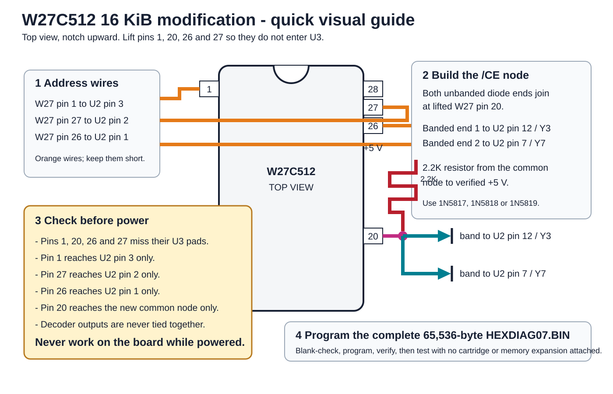

<!-- SPDX-License-Identifier: CC-BY-4.0 -->
# 16 KiB Diagnostic BIOS

## Console Tester operator and modification manual

github.com/hexbus - September 2026
Public Beta 0.8 - use with caution

This ROM turns the Geoff Trott/SHIFT838 Console Tester V1 into a stand-alone
diagnostic for the TI-99/4 and TI-99/4A. It boots with the tester's LOAD
button, runs useful checks before it needs a working keyboard, and leaves six
lamps as a readable result even when the video section of the console is dead.

The public beta has been exercised on stock TI-99/4A consoles, a V2.2 console,
a TI-99/4, and a TI-99/4A with no console GROMs installed. Replacement video
hardware may differ at the edges, so treat this as a diagnostic aid rather
than an infallible verdict.

> **Important:** The full VRAM tests overwrite all 16 KiB of video RAM. Switch
> the console off before fitting or removing the tester, EPROM, or wiring.

## Quick start

1. Switch the console off.
2. Insert the Console Tester firmly and connect the normal video output.
3. Switch the console on.
4. Press the tester's LOAD button. A TI-99/4A can also select
   **HEXBUS DIAG 1.0** from the cartridge menu when the 16 KiB modification is
   fitted.
5. Watch the six lamps. They should walk once from the front green lamp to the
   rear red lamp before the automatic tests settle.
6. Read the automatic-results screen. Green means that a test completed and
   passed; red is reserved for an actual failure.
7. Press a key to open the main menu. Use **1 through 8** to select a test,
   **0** to return from a test, and **R** for a warm start.

The original TI-99/4 does not understand the TI-99/4A cartridge header. Use
the LOAD button on a /4.

## What the lamps mean before video appears

The lamps are the first diagnostic display. They remain useful when the VDP,
VRAM, or video output is not working.

Orient the board component-side up with the edge connector toward the console.
The populated row is three green lamps followed by three red lamps:

| Position, front to rear | Normal v0.8 meaning | Latch mask |
| --- | --- | ---: |
| Green 1 | CPU, tester SRAM, and common scratchpad passed | >1000 |
| Green 2 | VDP port and VRAM tests passed | >2000 |
| Green 3 | Console ROM/GROM reads and diagnostic ROM passed | >4000 |
| Red 1 | CPU, tester SRAM, or scratchpad failure | >0100 |
| Red 2 | VDP or VRAM failure | >0200 |
| Red 3 | Console ROM/GROM read or diagnostic-ROM failure | >0400 |

At power-up or LOAD, the ROM writes those six masks one at a time in the order
shown. This proves the latch and all six populated outputs before the results
are trusted. The automatic tests then begin with the red group lit. Each
passing group trades its red lamp for the matching green lamp.

### Normal no-video sequence

1. Six individual lamps walk front to rear.
2. The three red lamps show that the result groups are pending.
3. Green 1 appears after the CPU and RAM group passes.
4. Green 2 appears after the VDP/VRAM group passes.
5. Green 3 appears after stable ROM/GROM reads and the diagnostic self-test.
6. All three green lamps remain on. The combined final write is >7000.

If the screen never appears, the last stable lamp state narrows the search:

| What remains lit | Where to start looking |
| --- | --- |
| No walk at all | Power, connector seating, LOAD circuitry, ROM selection, CPU, or tester workspace |
| Red 1 | CPU execution, U7 tester SRAM, or >8300->83FF scratchpad access |
| Green 1 and red 2 | VDP ports, VRAM, VDP clocking, or the video path |
| Green 1, green 2, and red 3 | Programmed EPROM, ROM decode, console ROM/GROM reads, or diagnostic checksum |
| All three green | Automatic hardware tests completed; troubleshoot display output or a later interactive test |

The write **>0800** is an intentional all-lamps-off value. The latch accepts
the bit, but no lamp is fitted to that output. Seeing the row go dark after
that write is correct.

Do not use the old TI RAM Trap switch table to interpret this ROM. That table
belongs to a different program with different lamp meanings.

## Automatic results screen

The opening screen reports tests that can run without operator judgment:

- representative TMS9900 instruction paths;
- U7 tester SRAM and the common console scratchpad range;
- 16 KiB of VRAM;
- stable CPU ROM and GROM reads;
- the diagnostic ROM's own checksum; and
- the presence and checksum of the 16 KiB extension.

Firmware identity is descriptive, not a pass/fail test. A stable replacement
ROM, replacement GROM, or mixed set is shown as **CUSTOM/MIXED - STABLE** and
does not create a red failure by itself. **NO DATA?** means the read path
returned no useful GROM data. Raw checksum values are identification data only.

**R WARM START** repeats the automatic checks and returns to this page. It is
not a console reset, and it does not test the keyboard, joysticks, sound,
lamps, or picture by itself.

## Main menu

### 1 - System information

Shows the automatic results, firmware-set label, component checksums, and the
16 KiB extension state. Use this page when recording a console's configuration
or comparing two machines.

### 2 - Keyboard and joysticks

Shows the translated character, physical matrix state, modifiers, Alpha Lock,
and both joystick inputs live. Hold **0** to return.

On the TI-99/4A, Alpha Lock down produces uppercase letters and Alpha Lock up
allows lowercase letters. FCTN combinations printed on the key fronts are
named or displayed, including the four direction keys. Control-letter chords
are shown as CTRL-A through CTRL-Z. The two unused matrix positions are
reported as AUX-1 and AUX-2 for modified keyboards.

Both joysticks remain live whether Alpha Lock is up or down. If it is down, the
page displays **JOYSTICKS: RELEASE ALPHA LOCK** as a precaution because Alpha
Lock can interfere with joystick Up on an original /4A. A QI console may still
show joystick Up correctly; the advisory does not suppress that reading. With
Alpha Lock released, Beta 0.8 keeps the shared scan line in the state verified
to read Up correctly on both joystick ports of an original /4A.

The TI-99/4 has an uppercase-only keyboard repertoire. Its joystick selectors
are columns 5 and 6. The TI-99/4A uses columns 6 and 7. The diagnostic scans
the TMS9901 matrix directly and does not call the console ROM keyboard routine,
which is why the menu remains usable on a /4A with no GROMs installed.

### 3 - VRAM tests

Provides a screen-preserving check plus one-pass and continuous 17N March-B
tests. The destructive tests cover all 16 KiB of VRAM with several data
patterns. Hold **0** to stop a continuous pass and return to the menu.

### 4 - VDP pattern test

Exercises character, Text, Multicolor, sprite, and status-flag behavior. The
TI-99/4 path skips bitmap/Graphics-II because the original TMS9918 does not
support it. A /4 fitted with replacement video hardware still follows the
console profile, so the skipped stage is not proof of the fitted chip type.

#### What to expect on the sprite page

The test creates five sprite entries on the same scanline, but it does not
normally show five separate objects. The first two entries occupy exactly the
same position: a red sprite is in front of a white sprite. Together they form
one clean red collision object. Cyan and light-blue sprites are separate. The
yellow entry is fifth in the scanline and tests the configured sprite limit.

| VDP mode | Expected visible groups |
| --- | --- |
| Original four sprites per scanline | Three: red collision object, cyan, and light blue. Yellow is hidden. |
| Enhanced limit above four | Four: red collision object, cyan, light blue, and yellow. |

The sequence repeats in 8x8, 16x16, and magnified modes. Shapes should remain
intact while moving. **COLL SET** reports the intentional overlap and
**5TH-SPR SET** reports the legacy status condition; neither message means that
yellow must be visible. A Pico9918 configured for four sprites per scanline
matches an original TMS VDP and shows three groups. An F18A or Pico9918 with a
higher limit can show all four groups. Yellow therefore describes the current
sprite-limit configuration, not a pass/fail result or a reliable VDP identity.

Press **0** at any timed page to return.

### 5 - Wave and PSG music

Runs the ported MegaDemo raster-wave effect with its original PSG music data.
The picture and music are both part of the inspection. Press **0** to stop.

### 6 - Identify bad VRAM IC

Maps a repeatable VRAM data-bit failure to the likely 4116 position on a stock
TI-99/4A board. More than one bad bit, intermittent faults, socket problems,
or replacement VRAM hardware can make the map ambiguous. The TI-99/4 does not
use the same VRAM arrangement, so this is primarily a /4A aid.

### 7 - Sidecar and LED test

Runs an individual lamp walk, a Larson scanner, cumulative fill/drain, and
alternating green/red patterns. After the automatic patterns, each non-zero
key advances one lamp and holds it. Press **0** to restore the automatic
result mask and return.

### 8 - Credits

Lists the original tester hardware/software work and the sources used by this
revision. Press **0** to return.

## 16 KiB W27C512 hobby modification

The original tester selects one 8 KiB ROM window at CPU >E000->FFFF. This
modification adds a second 8 KiB window at >6000->7FFF while leaving U7 SRAM
at >C000->DFFF. It is direct address mapping, not bank switching: both ROM
windows are visible at the same time.

The temporary circuit described here is the physically tested two-diode
version. A carrier socket is strongly recommended so the W27C512 itself is
not repeatedly bent.

### One-page wiring picture

### Parts

- one W27C512 in a 28-pin carrier;
- two matching Schottky diodes: 1N5817, 1N5818, or 1N5819;
- one 2.2K pull-up resistor;
- insulated hookup wire; and
- continuity tools and, preferably, an oscilloscope for checking /CE.

Do not identify a diode only as 1N5xxx; read the complete part number. Do not
substitute a 1N4148-class silicon diode without proving the TTL logic-low
margin.

### Lift these four W27C512 pins

Lift or fold these pins clear of the U3 socket. They must not touch their
same-numbered U3 pads.

| W27C512 pin | Signal | Wire to |
| ---: | --- | --- |
| 1 | A15 | U2 pin 3, TI A0, address weight >8000 |
| 20 | /CE | New pulled-up diode common node |
| 26 | A13 | U2 pin 1, TI A2, address weight >2000 |
| 27 | A14 | U2 pin 2, TI A1, address weight >4000 |

All other W27C512 pins enter their matching socket contacts. Pin 28 is +5 V,
pin 14 is ground, and pin 22 /OE keeps the board's original read-qualified
path. Viewed from above with the notch at the top, pin 1 is upper left and
pin 28 is upper right.

### Build the /CE selector

1. Join the **unbanded anodes** of both Schottky diodes at lifted W27 pin 20.
2. Connect the **banded cathode** of one diode to U2 pin 12/Y3 (>6000).
3. Connect the **banded cathode** of the other diode to U2 pin 7/Y7 (>E000).
4. Connect the 2.2K resistor from the common pin-20 node to verified +5 V.
   W27 pin 28 is convenient after it has been confirmed as +5 V.

The pull-up keeps /CE high when neither window is selected. Either active-low
74LS138 output can pull /CE low through its diode without tying the two
push-pull decoder outputs together. **Never connect Y3 and Y7 directly.**

### Continuity check before power

With the tester disconnected from the console, verify every item:

- W27 pins 1, 20, 26, and 27 do not contact the same-numbered U3 pads;
- W27 pin 1 reaches U2 pin 3 only;
- W27 pin 27 reaches U2 pin 2 only;
- W27 pin 26 reaches U2 pin 1 only;
- W27 pin 20 reaches the diode common node only;
- the diode bands face U2 pins 12 and 7;
- the common node has a 2.2K path to +5 V;
- W27 pin 22 still reaches the original /OE path;
- W27 pins 28 and 14 reach +5 V and ground;
- no decoder outputs are shorted together; and
- no lifted leg can spring back onto its pad or touch an adjacent pin.

Check resistance between +5 V and ground before inserting the board.

### Program and bring up the board

Program the complete 65,536-byte file **build/HEXDIAG08.BIN** as a W27C512.
It is byte-identical to
**build/ti99-sidecar-diag-beta-0.8-16k-w27c512.bin**. Do not program either
raw 8 KiB component as though it were the positioned 64 KiB image.

1. Erase and blank-check the W27C512.
2. Program the entire image and run the programmer's verify pass.
3. Reconfirm the unmodified tester with its known-good 27C64 if the board's
   starting condition is uncertain.
4. Fit the modified carrier and begin with no cartridge, memory expansion, or
   second sidecar attached.
5. Press LOAD and confirm the six-lamp walk, automatic tests, and screen.
6. Confirm that the results page says **16K EXTENSION PRESENT**.
7. Run all eight menu choices before calling the installation complete.

For electrical qualification, unselected /CE should be above 2.2 V and is
preferably at least 2.7 V. Selected /CE should be below 0.8 V and will normally
be about 0.3-0.6 V.

The diode circuit is an excellent reversible modification. The permanent
SN74LS21 version has better timing and noise margin for a finished board.

## Larger ROM options

The present diagnostic needs only the two 8 KiB windows above. For a future
expansion:

- a 16 KiB LS21 circuit is the clean permanent equivalent;
- a 32 KiB W27C512 can use Y1, Y3, Y5, and Y7 with one LS21 gate;
- a four-diode 32 KiB W27C512 version is practical for a homebrew trial;
- a 40 KiB W27C512 can retain U7 by using both gates in one LS21 package; and
- 48 KiB direct ROM collides with U7 and requires a real workspace redesign.

The complete wiring and image layouts are kept in the
[hardware modification guide](HARDWARE-MODIFICATION-GUIDE.md). The 32 KiB and
40 KiB circuits are design options, not requirements for v0.8.

## Troubleshooting

### Nothing happens after LOAD

Start with power, connector seating, the >E000 select, the programmed image,
CPU execution, and U7 tester SRAM. Refit the known-good 27C64 if necessary.

### The lamps walk but no screen appears

Use the last stable lamp state and the no-video table near the beginning of
this manual. If all three green lamps settle, the automatic tests completed
and the problem is likely in display output or later screen setup.

### The screen says 16K EXTENSION CORRUPT

Check A13-A15, both Y3/Y7 selection paths, W27 pin 20, the programmer's verify
result, and the extension checksum. The fixed >E000 core can still run when
the second window is missing.

### Menus contain colored fragments or garbage

Make sure the current public-beta image is fitted. An earlier development
build could leave VDP table pointers and sprites active after the pattern
test. Version 0.8 erases both sprite tables and restores the normal screen
tables before drawing a menu.

### CUSTOM/MIXED - STABLE appears

That is not a failure. Repeated reads agreed, but the ROM/GROM set does not
match one complete stock profile.

### Replacement video hardware behaves differently

Record the console model, the fitted device, and its configuration. Version
0.8 identifies `TMS FAMILY`, `F18A`, `PICO9918`, or an unfamiliar
`F18A COMPAT` interface, but it does not distinguish every original TMS die.
The number of visible sprites can also depend on the replacement VDP's
configured per-scanline limit.

## Further technical information

See the [hardware modification guide](HARDWARE-MODIFICATION-GUIDE.md),
[technical reference](TECHNICAL-REFERENCE.md),
[source and build guide](SOURCE-BUILD-GUIDE.md), and
[provenance and licensing notes](PROVENANCE.md).
